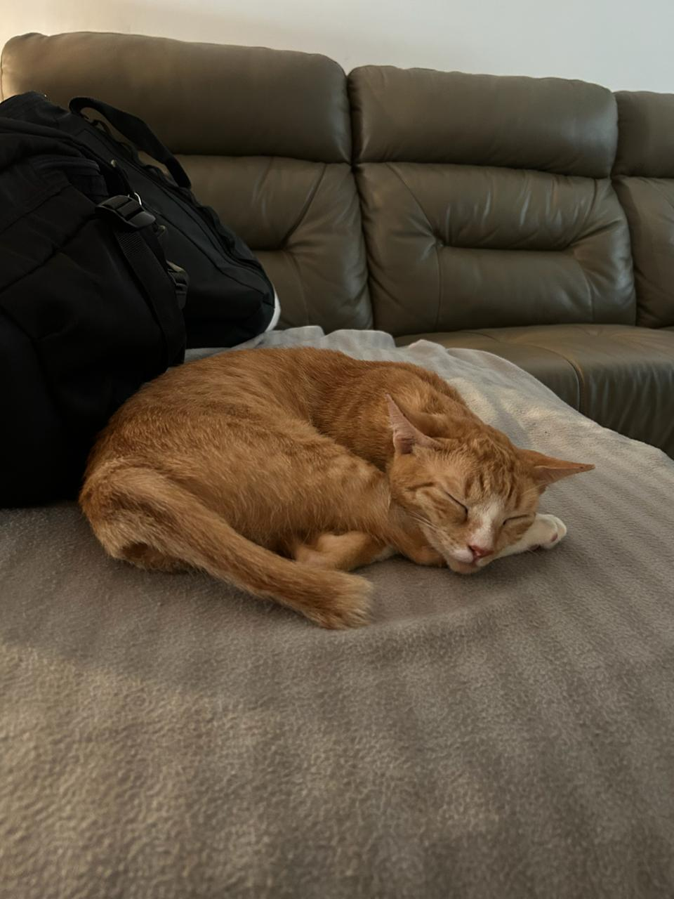
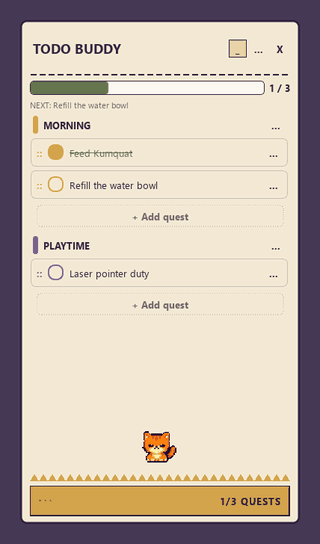

# Todo Buddy

Todo Buddy is one of my pet project... get it... (HAHAHA) A Windows-based floating quest card. 
It keeps a small grouped todo checklist above normal desktop windows and stores everything in a
readable JSON file. No account, network connection, or backend is required.

This project is inspired by my oyen cat, **Kumquat**. I missed her while I
was away at work, so I built a Buddy that works alongside me when I can't
be with her, she naps, she stretches when she is awake, she celebrates when you finished a quest, and she gets grumpy about interruptions, just like she does.


<p align="center">
  
  <br>
  <em>Kumquat</em>
</p>

## See It In Action

Add a quest right where it belongs, tick it off (she celebrates), shrink the
whole card down to just Kumquat, and click her to bring it all back:

<p align="center">
  
</p>

## Requirements

- Windows 10 or 11
- Python 3.11 or newer

Python 3.11 was used for the verified development environment.

## PowerShell Setup

```powershell
cd <path-to>\todo-buddy
py -3.11 -m venv .venv
.\.venv\Scripts\Activate.ps1
python -m pip install --upgrade pip
python -m pip install -e ".[dev]"
python -m pytest -q
python -m todo_buddy
```

If script activation is disabled, use the venv interpreter directly:

```powershell
.\.venv\Scripts\python.exe -m pip install -e ".[dev]"
.\.venv\Scripts\python.exe -m todo_buddy
```

## Git Bash Setup

```bash
cd /c/<path-to>/todo-buddy
py -3.11 -m venv .venv
source .venv/Scripts/activate
python -m pip install --upgrade pip
python -m pip install -e '.[dev]'
python -m pytest -q
python -m todo_buddy
```

## Using The Card

- Grab the header (the project title) to drag the card around.
- Tick checkboxes with the mouse, or Tab over and hit Space/Enter.
- Want to reorder quests? Drag a row by its `::` grip (or just the text) and
  drop it wherever — even under a different category. It saves right away.
- The `...` next to a quest lets you edit or delete it.
- The `...` next to a category lets you rename it, pick a color, or delete it
  (along with everything in it).
- Hit the `+ Add quest` row at the bottom of any category to type a new quest
  right there — no pop-ups. Enter adds it and keeps the box open for the next
  one, Esc backs out, and clicking away just saves whatever you typed.
- The `...` in the header is the big menu: add categories, rename the card,
  mark everything complete/incomplete, or clear out finished quests.
- `_` shrinks the whole card down to just the pixel cat, so Kumquat can hang
  out on your desktop without the list. Click her to pop the card back open,
  or drag her somewhere comfier first. The tray icon's `Show Todo Buddy`
  brings the card back too.
- `Reset sample data...` double-checks with you first, and keeps your old JSON
  around as `tasks.backup-YYYYMMDD-HHMMSS.json` just in case.
- `X` and `Exit` both close the app for real.

Kumquat has a life of her own: leave her alone for 20 seconds and she
falls asleep, poke her and she does a little wake-up stretch (a one-shot
`WAKE_UP` transition), finish a quest and she celebrates, drag the card around
and she gets grumpy about it. All five moods play from sprite sheets in
`asset/cat_animation/` — six 64x64 frames each, crunchy hard-edged pixel art
with no smoothing. If a sheet is missing or broken, she quietly falls back to
the original Qt-painted cat.

Need to rebuild the sheets? They come from the grid image in
`asset/cat_animation/_source/` via
`python tools/build_cat_sheet.py Animated_kumquat.jpeg --grid`. The sheet
format and how to add a new mood live in `asset/cat_animation/README.md`;
the tool needs `pip install -e ".[tools]"`.

## Local Data

The default data file is:

```text
%LOCALAPPDATA%\TodoBuddy\tasks.json
```

The file is created on the first mutation, not merely by opening the app. Saves
write and flush a temporary file in the same directory before using atomic
replacement. To use a development or portable data file, set:

```powershell
$env:TODO_BUDDY_DATA_PATH = "C:\temp\todo-buddy\tasks.json"
python -m todo_buddy
```

The JSON has schema version 1 and can be edited while the app is closed. IDs
must remain unique and completion timestamps must be timezone-aware ISO-8601
values. A malformed or incompatible file produces a recovery prompt. Canceling
leaves it untouched; confirming recovery first creates a timestamped backup.

## Tests

One command, whole suite:

```powershell
.\.venv\Scripts\python.exe -m pytest -q
```

It runs headless (Qt flips to the offscreen platform on its own) and never
touches your real task file — every test works against throwaway in-memory
data, so run it as often as you like.

Pretty much everything is covered: models and their round trips, category
colors, UTC completion times, path overrides, missing or corrupt data, atomic
saves and backups, quest mutations, drag-and-drop targeting, progress
ordering, window flags, checkbox signals, Kumquat's moods, UI refresh,
position clamping, and the Microsoft Graph mapping contracts. If you break
something, a test will probably tattle.

## Packaging

Want a standalone `.exe`? PyInstaller has you covered:

```powershell
.\.venv\Scripts\python.exe -m pip install -e ".[package]"
.\.venv\Scripts\python.exe -m PyInstaller --noconfirm --clean --windowed `
  --name TodoBuddy --paths src `
  --add-data "asset;asset" `
  src\todo_buddy\__main__.py
```

Don't drop the `--add-data "asset;asset"` bit — that's what packs the sprite
sheets in. Skip it and pixel Kumquat gets swapped for her old Qt-painted
stand-in.

Your build lands in `dist\TodoBuddy\TodoBuddy.exe`. It's unsigned, so Windows
SmartScreen might give it the side-eye on first launch — that's expected;
code signing is a problem for another day.

## Contributing

Found a bug, or want to teach Kumquat a new trick? Contributions are very
welcome — just open a pull request.

And if you'd like an oyen buddy of your own: Todo Buddy is free to use.
Kumquat is happy to keep you company too.

